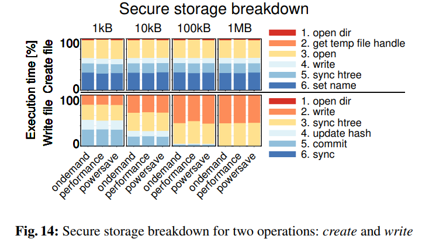
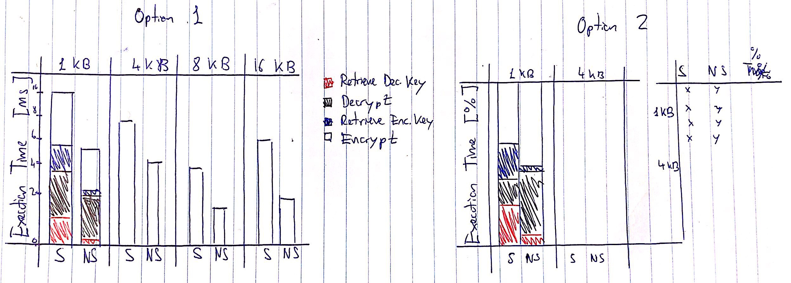

### MQT-TZ: Running mosquitto in the TrustZone

**Repository Directory:**
1. Implementation:
    + [MQT-TZ: Custom `mosquitto` implementation, Client and Broker](https://github.com/csegarragonz/mqttz)
    + [Trusted Applications 4 TrustZone](https://github.com/csegarragonz/optee-apps)
2. Dissemination:
    + [SysTEX](https://github.com/vschiavoni/unine-csem/tree/master/SYSTEX19)
    + [MIDDLEWARE](https://github.com/vschiavoni/unine-csem/tree/master/MIDDLEWARE19)

#### To-Do List:

**Implementation:**
1. Client:
    1. Key Exchange
        1. Support Asymmetric Encryption.
2. Broker:
    1. Key Exchange
        1. Filter `id_query` Topics
        2. Support Asymmetric Encryption
    2. Payload Reencryption
        1. Key Retrieval from Persistent Storage Working.
        2. Locate where in the broker implementation do the reencryption
        3. Link with the pluggable reencryption method
3. Deployment:
    1. Run custom `mosquitto` implementation in Buildroot
    2. Move everything to my personal laptop

**Evaluation:**
1. Make artificial ECG generator.
    1. Get my hands on the `.h5` file!!!
2. Microbenchmarks:
    1. **uB1: TrustZone Reencryption:**
        + How many bytes/second can we reencrypt in the SW and how does it compare to the Normal World?
        + Measure:
            + Time to retrieve decrypt Key from Secure Storage
            + Time to decrypt payload
            + Time to retrieve encrypt key from Secure Storage
            + Time to encrypt payload
        + Vary:
            + Run in NW vs SW
            + Load Key from persistent storage vs in memory?
            + Payload Size of 1kB, 4kB, 8kB, 16kB
        + Plot Structure:
            + 
            + 
    2. **uB2: Key Exchange Performance**
        + How much time does our Key Exchange protocl take?
        + Measure:
            + Time Spent for the 1st Key Exchange
                + Overhead (`mosquitto` connect + TLS Handshake)
                + Time in client (generate Sym Key)
                + Time in server:
                    + Time outside TZ: before TA call and after.
                    + Time inside TZ: decrypt and store in SS
                + Time in client (decrypt OK)
            + Time spent for the 2nd Key Exchange (epsilon?) no interaction w/ server
        + Compare w/ what?
3. Macrobenchmarks
    1. **MB1: Streaming a whole 100 Hz ECG**
        + What is the performance of our secure MQTT broker when streaming a whole 100 Hz ECG during a given period of time.
        + Measure:
            + Overall Latency defined as time from sending first byte to the last one.
            + Time spent in 1st Handshake (Key Exchange)
            + Client Encryption Time
            + Time Spent in Broker
                + Time spent in TZ
            + Client Decryption Time
            + Time spent in >1 handshakes (no key exchange)
        + Compare:
            + Vanilla `mosquitto`
            + Vanilla `mosquitto` w/ TLS + ACL
            + MQTTZ w/ reencryption in the NS world
            + MQTTZ w/ reencryption in the S world
            + HiveMQ (w/ and w/out TLS if available)
            + Tesarakt: request a Demo? [lol](https://teserakt.io/)
            + A secure Pub/Sub alternative platform/protocol (rather than MQTT)
        + Vary:
            + Package Size?
        + Considerations:
            + What implicit flow control mechanisms are running under the hood? (`mosquitto`, ...)
        + Plot Structure

**Figures:**
1. **F1: MQT-TZ Architecture**
2. **F2: Key Exchange Protocol**
3. **F3: TrustZone Architecutre?**

**Dissemination:**
1. 15/08/19 - SysTEX
    + Plots:
    + Figures:
        1. F1: make it one-column width
    + Notes:
        + Make one-liner of the authors
2. 06/09/19 - Middleware (Industrial Track)
